# my-codespace-2026

# JavaScript Learning Journey

This repository documents my **daily JavaScript learning progress** using  
**GitHub Codespaces + VS Code**.

I am learning step-by-step with **hands-on practice** and **daily commits**.

---

## 📅 Day 1: Variables & Data Types

### Topics Covered
- Variables (`let`, `const`)
- Data Types
  - Number
  - String
  - Boolean
  - Null
  - Undefined
- Updating variable values
- `console.log()` usage
- Running JavaScript using Node.js

### Programs Practiced
- Store and print values
- Check data types using `typeof`
- Update variable values
- Display multiple values together
- Redeclaration vs reassignment

### Key Learning
> Variables can be **declared once** and **updated many times** using `let`.

---

## 📅 Day 2: Conditions (if / else)

### Topics Covered
- `if`, `else`, `else if`
- Comparison operators (`>`, `<`, `>=`, `<=`, `===`)
- Logical operators (`&&`)
- Decision making

### Programs Practiced
- Positive / Negative number
- Even / Odd number
- Voting eligibility
- Largest of two numbers
- Pass / Fail
- Grade system
- Login validation
- Temperature check
- Number range check

### Key Learning
> JavaScript executes **only the block whose condition is true**.

---

## 📅 Day 3: Loops (for / while)

### Topics Covered
- `for` loop
- `while` loop
- Loop conditions and increments
- Accumulation using loops
- `break` statement
- Printing output line by line vs side by side

### Programs Practiced
- Print numbers (1–10)
- Even and odd numbers
- Sum of numbers
- Multiplication table
- Countdown using `while`
- Stop loop using `break`

### Key Learning
- Loops reduce repetition
- `for` is used when iterations are known
- `while` is used when condition controls the loop

---

## 📅 Day 4: Functions

### Topics Covered
- What is a function
- Creating and calling functions
- Parameters and arguments
- `return` statement
- Functions with conditions and loops
- Default parameters
- Arrow functions (intro)

### Programs Practiced
- Simple function
- Function with parameters
- Add two numbers
- Square of a number
- Even / Odd function
- Age eligibility checker
- Sum from 1 to N
- Arrow function
- Calculator function

### Key Learning
- Functions avoid repeating code
- `return` sends data back from a function
- `console.log()` only displays output

---

## 📅 Day 5: Arrays

### Topics Covered
- What an array is
- Creating arrays
- Accessing array elements using index
- Array length
- Updating array values
- Looping through arrays
- Common array methods:
  - `push()`
  - `pop()`
  - `shift()`
  - `unshift()`

### 🧪 Programs Practiced
- Create and print an array
- Access elements using index
- Find array length
- Update array values
- Loop through array using `for`
- Add elements using `push()`
- Remove last element using `pop()`
- Add element at start using `unshift()`
- Remove element from start using `shift()`
- Find sum of numbers in an array

### Key Learnings
- Arrays store multiple values in one variable
- Array index starts from **0**
- `.length` helps control loops
- `push()` adds an element at the end
- `pop()` removes the last element
- `unshift()` adds an element at the beginning
- `shift()` removes the first element
- Loops are commonly used to work with arrays

---

## 🛠 Tools Used
- JavaScript (Node.js)
- Visual Studio Code
- Git & GitHub
- GitHub Codespaces

---

## 🔁 Daily Routine
1. Learn concepts
2. Write programs
3. Run code using Node
4. Fix errors
5. Commit & push to GitHub

---

## 📈 Learning Progress

```mermaid
graph TD
    D1["Day 1<br/>Variables & Data Types ✅"]
    D2["Day 2<br/>Conditions if/else ✅"]
    D3["Day 3<br/>Loops ✅"]
    D4["Day 4<br/>Functions ✅"]
    D5["Day 5<br/>Arrays ✅"]
    D6["Day 6<br/>Objects ✅"]
    D6["Day 7<br/>Arrays of objrct + real practice ⏳"]

    D1 --> D2
    D2 --> D3
    D3 --> D4
    D4 --> D5
    D5 --> D6
    D6 --> D7
```

---
> Consistency over speed. Learning by doing.
---